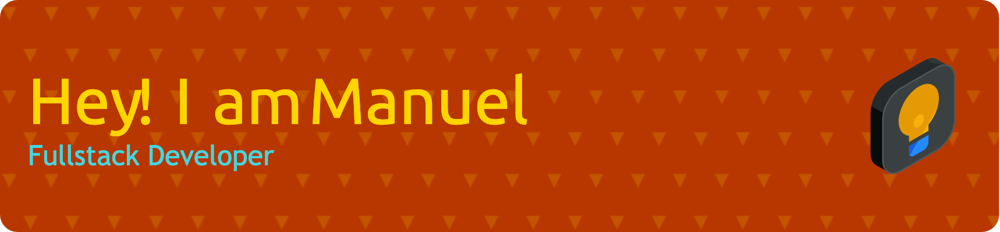

[//]: # (## 🔭 I'm currently working on ...)

## 🌱 I’m currently learning ...
Advanced React patterns, TypeScript, and exploring microservices architecture using Docker and Kubernetes. 
I'm also making my steps into Java Spring.

## 👯 I’m looking to collaborate on ...
Open-source projects focused on environmental sustainability and educational tools for underprivileged communities.

## 💬 Ask me about ...
Full-stack development, RESTful APIs, and creating intuitive user experiences.

## 📫 How to reach me ...
You can reach me at manuel.stolze93@hotmail.com or connect with me on [Xing](https://www.xing.com/profile/Manuel_Stolze2).

<!--
**manuelstolze/manuelstolze** is a ✨ _special_ ✨ repository because its `README.md` (this file) appears on your GitHub profile.

Here are some ideas to get you started:

- 🔭 I’m currently working on ...
- 🌱 I’m currently learning ...
- 👯 I’m looking to collaborate on ...
- 🤔 I’m looking for help with ...
- 💬 Ask me about ...
- 📫 How to reach me: ...
- 😄 Pronouns: ...
- ⚡ Fun fact: ...
-->
